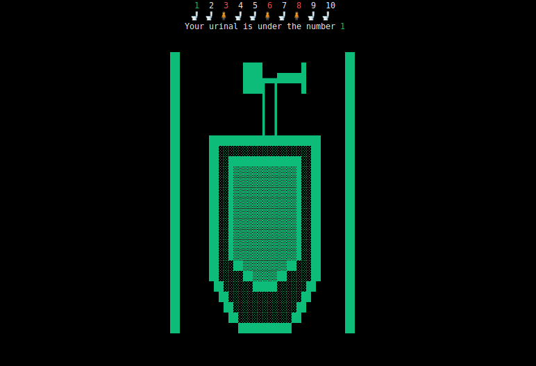

# Assistant choice place at urinal


## How to choose the right place? Use the program!

## 1. Run app
```bash
go run cmd/main.go
```
## 2. Enter a quantity urinal


## 3. Specify the seats that are occupied and press button

- Right -> Tab
- Left -> Shift + Tab

## 4. Check result and happy pee
